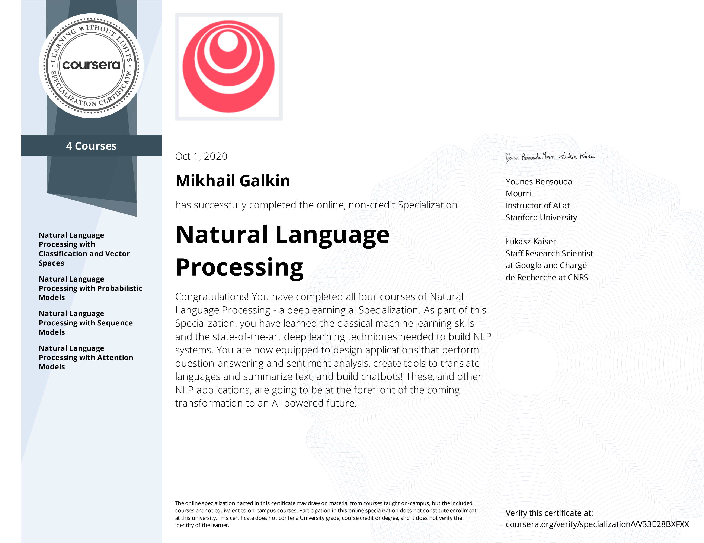

#### This repository contains working notebooks on [Specialization](https://www.deeplearning.ai/program/natural-language-processing-specialization/) offered by [DeepLearning.ai](https://deeplearning.ai) through Coursera.

There are 4 Courses in this Specialization:
1. [Natural Language Processing with Classification and Vector Spaces](https://www.coursera.org/account/accomplishments/verify/KXU8JAJGAR4Z).
2. [Natural Language Processing with Probabilistic Models](https://www.coursera.org/account/accomplishments/verify/ZT8CAXKJSTLA).
3. [Natural Language Processing with Sequence Models](https://www.coursera.org/account/accomplishments/verify/YF2PHHWQHWV7).
4. [Natural Language Processing with Attention Models](https://www.coursera.org/account/accomplishments/verify/PG4RLCBM8P8R).

#### Specialization Certificate
I've successfully completed all courses at the specialization and earned my [certificate](https://www.coursera.org/account/accomplishments/specialization/VV33E28BXFXX).

